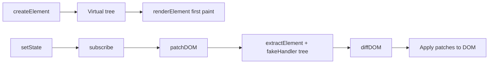

# Mini Framework Guide

This guide documents the mini JavaScript UI framework in this repository. It answers three essential questions:

1. **What does the framework offer?** — A top-level overview of features (below).
2. **How do you build UI?** — Creating elements, attributes, events, and nested children (with code examples).
3. **How does it work internally?** — The flow from virtual elements to DOM updates.

---

## Top-Level Overview: Framework Features

Mini Framework is a small, educational UI library built with vanilla JavaScript and ES modules. You describe the UI as plain objects; the framework turns them into real DOM nodes and can update only what changed when state or routes change.

| Feature | Module | What it does |
|--------|--------|----------------|
| **Virtual elements** | `fw/create-element.mjs` | Build UI as plain objects (`createElement`) instead of touching the DOM directly |
| **Rendering** | `fw/render-elemnt.mjs` | Walk the virtual tree and create real DOM nodes (`renderElement`) |
| **Reactive state** | `fw/state-managment.mjs` | Store data with `getState`, `setState`, and `subscribe` |
| **Hash routing** | `fw/routing.mjs` | Navigate with `#/`, `#/active`, etc., and run route handlers |
| **Diff & patch** | `fw/diffing.mjs`, `fw/patching.mjs` | Compare old and new virtual trees and patch the DOM in place |
| **Helpers** | `fw/helpers.mjs` | Shared utilities (attributes, events, DOM extraction, virtual root) |

**Typical workflow:**

1. Call `createElement(...)` to describe UI.
2. Call `renderElement(...)` to mount it (first paint).
3. Use `createState(...)` for data; on change, call `patchDOM(router)` or re-render.
4. Register routes with `RouterConstructor` and `routing(...)` for hash-based pages.

The included **TodoMVC** demo (`todomvc/index.mjs`) shows lists, events, state, routing, and patching together.

---

## How To Build UI (With Code Examples)

All UI is built with `createElement`. Its signature is:

```js
createElement(tagName, attributes = {}, events = {}, ...children)
```

Every call returns a virtual element object:

```js
{
  tagName: "button",
  attributes: { class: "save-btn" },
  events: { click: handleClick },
  children: [ { tagName: "text", content: "Save" } ]
}
```

Strings and numbers passed as children are normalized to `{ tagName: "text", content: "..." }`.

To show virtual elements on the page, use `renderElement`:

```js
import createElement from "./fw/create-element.mjs";
import renderElement from "./fw/render-elemnt.mjs";

const root = document.getElementById("root");
renderElement(true, root, /* one or more virtual elements */);
```

- First argument `true` clears the parent before rendering; `false` appends without clearing.
- Remaining arguments are virtual elements to render.

---

### Create an element

Pass a tag name, then attributes, events, and children.

```js
import createElement from "./fw/create-element.mjs";

const title = createElement("h1", {}, {}, "Hello world");
```

- `"h1"` — HTML tag name  
- First `{}` — no attributes  
- Second `{}` — no events  
- `"Hello world"` — text child (converted to a `text` node automatically)

Mount it:

```js
import renderElement from "./fw/render-elemnt.mjs";

const root = document.getElementById("root");
renderElement(true, root, title);
```

---

### Add attributes to an element

Attributes go in the **second** argument.

```js
const input = createElement(
  "input",
  {
    id: "todo-input",
    class: "new-todo",
    type: "text",
    placeholder: "What needs to be done?",
  },
  {}
);
```

Conditional attributes work the same way:

```js
const checkbox = createElement(
  "input",
  {
    type: "checkbox",
    checked: true,
  },
  {}
);
```

The renderer treats `checked` specially so the DOM property and attribute stay in sync.

You can also put `onClick`-style handlers in the attributes object (they are converted to listeners). The dedicated `events` object (next section) is the clearer pattern used in the demo app.

---

### Create an event

The recommended pattern is the **third** argument: an `events` object whose keys are DOM event types.

```js
const button = createElement(
  "button",
  { class: "save-btn" },
  {
    click: () => {
      console.log("Saved");
    },
  },
  "Save"
);
```

On render, the framework calls `addEventListener("click", handler)` for that element.

Alternative: `on...` handlers inside attributes:

```js
const button = createElement(
  "button",
  {
    onClick: () => {
      console.log("Saved");
    },
  },
  {},
  "Save"
);
```

Other event types (`keydown`, `dblclick`, `input`, etc.) use the same `events` object shape.

---

### Nest elements

Pass other `createElement(...)` results as **children** (fourth argument onward).

```js
const card = createElement(
  "div",
  { class: "card" },
  {},
  createElement("h2", {}, {}, "Profile"),
  createElement(
    "p",
    {},
    {},
    "This paragraph is nested inside the card."
  )
);
```

Rendered HTML:

```html
<div class="card">
  <h2>Profile</h2>
  <p>This paragraph is nested inside the card.</p>
</div>
```

Arrays of children are flattened automatically. You can spread arrays when building lists:

```js
createElement("ul", { class: "todo-list" }, {}, ...items.map(itemToLi));
```

---

### Complete example (element + attributes + event + nesting)

```js
import createElement from "./fw/create-element.mjs";
import renderElement from "./fw/render-elemnt.mjs";

const root = document.getElementById("root");

const app = createElement(
  "section",
  { class: "app" },
  {},
  createElement("h1", {}, {}, "Mini Framework"),
  createElement(
    "button",
    { class: "primary-btn" },
    {
      click: () => {
        alert("Button clicked");
      },
    },
    "Click me"
  )
);

renderElement(true, root, app);
```

---

## How the Framework Works

The framework is built around one consistent idea: **describe UI as data first, then sync that data to the DOM.**

### Step 1: Virtual elements (description, not DOM)

`createElement` does not touch the browser DOM. It only returns a plain object that describes a node: tag, attributes, events, and children. That makes UI easy to create, compare, and test.

### Step 2: Recursive rendering (first paint)

`renderElement(clear, parent, ...elements)`:

1. Optionally clears the parent (`clear === true`).
2. For each virtual element:
   - **Text** (`tagName === "text"`) → `document.createTextNode`
   - **Element** → `document.createElement`, apply attributes and events, recurse into children, append to parent

Events from the `events` object and `on*` attributes both end up as `addEventListener` calls (via helpers in `fw/helpers.mjs`).

### Step 3: Reactive state (when data changes)

`createState(initialState)` returns:

- `getState()` — read current state  
- `setState(newState)` — shallow merge `{ ...state, ...newState }`, then notify subscribers  
- `subscribe(fn)` — run `fn` after each update  

Subscribers typically trigger a DOM update (re-render or patch).

### Step 4: Routing (which view to show)

The hash router (`RouterConstructor`, `routing`, `navigate`) listens to `location.hash` (e.g. `#/`, `#/active`). Each route has:

- **`handler`** — often a full `renderElement(true, ROOT, ...)` for initial or full redraws  
- **`fakeHandler`** — returns the virtual tree used for diff/patch (no full page wipe)

### Step 5: Diff and patch (efficient updates)

Instead of always clearing and rebuilding the DOM:

1. **`extractElement(ROOT)`** — read the current DOM back into a virtual tree (attributes and structure; native listeners are not reconstructed).
2. **`buildVirtualDomFromRoute(router)`** — build the desired tree from the active route’s `fakeHandler`.
3. **`diffDOM(oldTree, newTree)`** — produce a list of changes (add/remove/replace node, text, attribute, event).
4. **`patchDOM(router)`** — apply each diff to the real DOM at the correct path.

Supported patch types include: `TEXT`, `ATTRIBUTE`, `REMOVE_ATTRIBUTE`, `EVENT`, `REMOVE_EVENT`, `REPLACE`, `ADD`, `REMOVE`.

### End-to-end flow (TodoMVC-style app)



In short:

- **`createElement`** — describe UI  
- **`renderElement`** — mount UI to the DOM  
- **`createState` + `subscribe`** — react to data changes  
- **`routing`** — switch views by hash  
- **`diffDOM` + `patchDOM`** — update only what changed  

Everything uses the same virtual element shape, which keeps the codebase small and consistent.

---

## Module Reference

| File | Main exports |
|------|----------------|
| `create-element.mjs` | `createElement` |
| `render-elemnt.mjs` | `renderElement` |
| `state-managment.mjs` | `createState` |
| `routing.mjs` | `RouterConstructor`, `routing`, `navigate` |
| `diffing.mjs` | `diffDOM` |
| `patching.mjs` | `patchDOM` |
| `helpers.mjs` | `ROOT`, `extractElement`, `createRealNode`, `buildVirtualDomFromRoute`, attribute/event helpers |

Serve the project over HTTP (ES modules), for example:

```bash
python3 -m http.server 8000
```

Then open `http://localhost:8000/todomvc/`.
